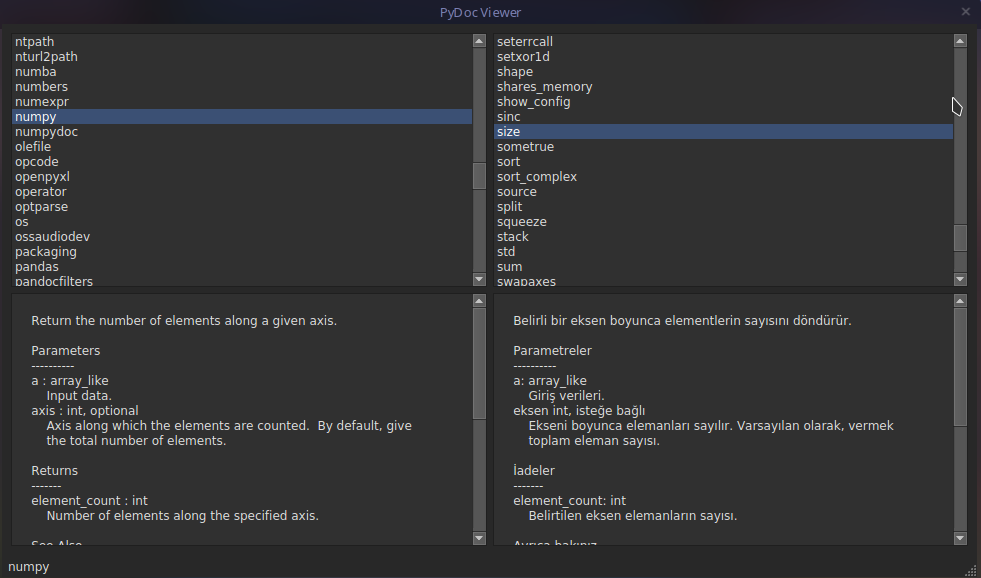

<!-- # Pydoc-viewer -->
<h1 align="center">
  Pydoc-viewer
</h1>

<div align="center">
  
</div>

## İndirme ve kurma

```
git clone https://github.com/Marceliny/pydoc-viewer
(İndirilen klasöre gidin)
pip -r requirements.txt
python design.py
```
